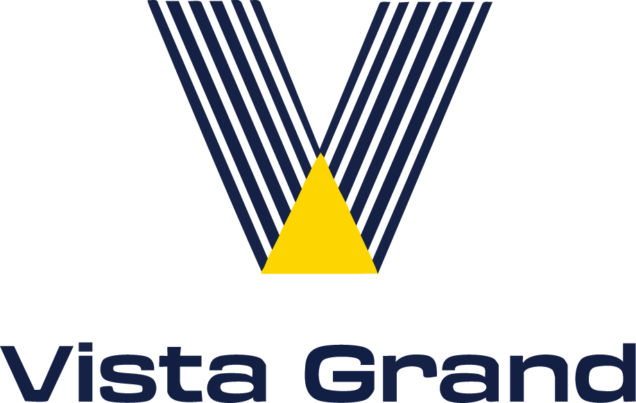

# Vista Grande Realty - Luxury Real Estate Website

A premium Next.js-based real estate website featuring elegant animations, premium page transitions, and a luxury design aesthetic.



## Features

### 🎨 Premium Design Elements
- **Luxury Aesthetic**: Gold accents, elegant typography, and sophisticated color palette
- **Responsive Design**: Fully responsive from mobile to large desktop screens
- **Custom Components**: Luxury buttons, cards, and UI elements
- **Premium Animations**: Subtle animations that enhance the luxury feel
- **Custom Cursor**: Enhanced cursor interactions (optional)

### ⚡ Performance Optimizations
- **Next.js App Router**: Utilizing the latest Next.js features
- **Image Optimization**: Automatic image optimization with next/image
- **Font Optimization**: Custom font loading with next/font
- **Code Splitting**: Automatic code splitting for optimal loading
- **SEO Optimized**: Structured data, meta tags, and OpenGraph support

### 🔄 Premium Page Transitions
- **Elegant Page Loader**: Beautiful loading animation between page transitions
- **Smooth Animations**: Framer Motion powered transitions
- **Persistent Audio**: Background audio that persists between page navigations
- **Loading States**: Visual feedback during page loading

### 📱 Enhanced Mobile Experience
- **Mobile-First Design**: Optimized for all device sizes
- **Touch-Friendly**: All interactions work well on touch devices
- **Hamburger Menu**: Custom animated mobile menu with scrollable content
- **Performance Focused**: Fast loading even on slower mobile connections

### 🧩 Component Library
- **Design System**: Comprehensive design system with consistent components
- **Reusable Components**: Modular components for easy maintenance
- **Interactive Elements**: Buttons, cards, and UI components with animations
- **Form Components**: Styled form elements with validation

### 🔒 Accessibility Features
- **Keyboard Navigation**: Full keyboard navigation support
- **Screen Reader Support**: ARIA attributes and semantic HTML
- **Focus Management**: Visible focus indicators
- **Color Contrast**: WCAG compliant color contrast

## Technical Implementation

### Core Technologies
- **Next.js 14**: App Router, Server Components, and Client Components
- **TypeScript**: Type-safe code throughout the application
- **Tailwind CSS**: Utility-first CSS framework for styling
- **Framer Motion**: Animation library for smooth transitions
- **React Icons**: Icon library for UI elements

### Advanced Features
- **Page Transition System**: Custom implementation for smooth page transitions
- **Loading Provider**: Context-based loading state management
- **Audio Background**: Persistent audio player with controls
- **Error Boundary**: Graceful error handling
- **Analytics Integration**: Google Analytics and Facebook Pixel support
- **SEO Components**: Structured data and meta tags

### Performance Optimizations
- **Suspense Boundaries**: React Suspense for improved loading states
- **Link Enhancement**: Custom link component with loading indicators
- **Image Optimization**: Automatic image optimization and lazy loading
- **Font Loading Strategy**: Optimized font loading to prevent layout shifts
- **Build Optimizations**: Production build optimizations

## Getting Started

### Prerequisites
- Node.js 18.17.0 or later
- npm or yarn

### Installation

1. Clone the repository:
```bash
git clone https://github.com/yourusername/vista-grande-realty.git
cd vista-grande-realty
```

2. Install dependencies:
```bash
npm install
# or
yarn install
```

3. Run the development server:
```bash
npm run dev
# or
yarn dev
```

4. Open [http://localhost:3000](http://localhost:3000) with your browser to see the result.

## Project Structure

```
/src
  /app                  # Next.js App Router pages
  /components           # Reusable components
    /ui                 # UI components
    /providers          # Context providers
    /seo                # SEO-related components
    /examples           # Example components for the design system
  /hooks                # Custom React hooks
  /lib                  # Utility functions and libraries
  /styles               # Global styles
  /types                # TypeScript type definitions
/public                 # Static assets
```

## Key Components

### Premium Page Loader
The `PremiumPageLoader` component provides an elegant loading experience with multiple stages:
- Initial logo animation
- Progress bar with percentage
- Smooth transition to content

### Navigation System
- `Navbar`: Responsive navigation with dropdown menus
- Mobile menu with scrollable content and fixed body
- Smooth transitions between pages

### UI Components
- `LuxuryButton`: Animated button with hover effects
- `PropertyCard`: Real estate property display card
- `AudioBackground`: Background music player with controls
- `ErrorBoundary`: Graceful error handling

## Deployment

The application is optimized for deployment on Vercel:

```bash
npm run build
# or
yarn build
```

## License

This project is licensed under the MIT License - see the LICENSE file for details.

## Acknowledgements

- [Next.js](https://nextjs.org)
- [Tailwind CSS](https://tailwindcss.com)
- [Framer Motion](https://www.framer.com/motion/)
- [React Icons](https://react-icons.github.io/react-icons/)
